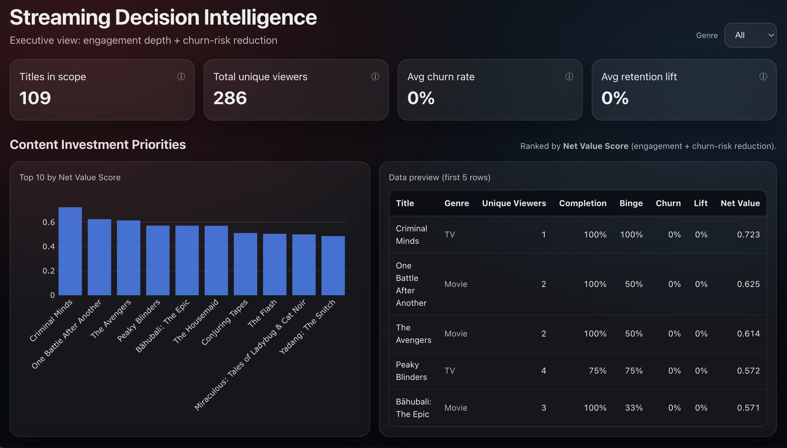
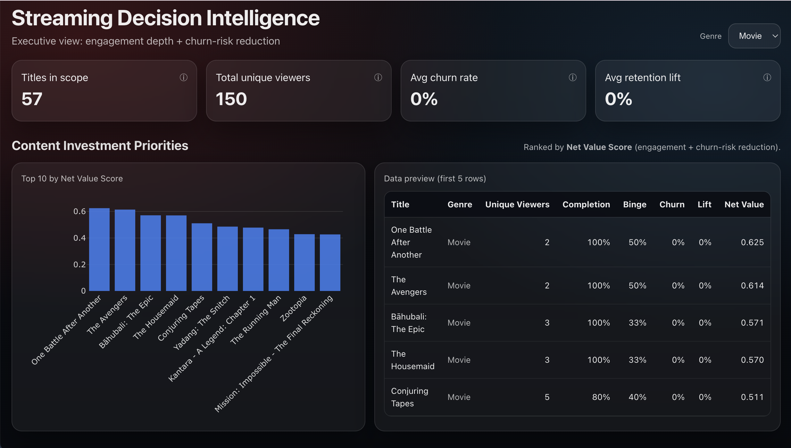

# Streaming Decision Intelligence Dashboard

Executive decision-support system designed to help streaming platforms prioritize content investment, promotion, and catalog strategy based on engagement quality and churn risk.

---

## Business Problem

Streaming platforms often rely on surface-level metrics like views and watch time to evaluate content. These metrics do not explain whether a title is actually retaining users or contributing to churn.

As a result, teams risk:

- Over-investing in content that drives short-term views but low retention  
- Under-promoting titles that meaningfully reduce churn  
- Lacking a consistent way to compare performance across titles and genres  

---

## Objective

Build a decision-support system that helps answer:

- Which titles are driving long-term value?  
- What content should be prioritized for investment or promotion?  
- How does engagement differ across genres?  

---

## Approach

Developed an interactive dashboard that evaluates content using a Net Value Score, combining engagement depth with churn-risk reduction signals.

Key components:

- Designed a scoring model that balances viewer engagement and retention impact  
- Built dynamic filtering to allow real-time comparison across genres  
- Centralized content performance into a single executive view  
- Enabled transparency through detailed metrics and breakdowns  

---

## Key Metrics

- Titles in Scope  
- Total Unique Viewers  
- Average Churn Rate  
- Retention Lift  
- Net Value Score (engagement + churn-risk reduction)

---

## Key Insights

- High-view titles do not always lead to strong retention  
- Certain genres consistently reduce churn more effectively  
- Mid-tier content with strong engagement depth can outperform top-viewed titles in long-term value  

---

## Recommendations

- Shift promotional focus toward titles that improve retention, not just views  
- Prioritize investment in genres with consistent retention lift  
- Use Net Value Score as a standard metric for evaluating content performance  

---

## Screenshots

### Executive Overview

The executive dashboard provides a centralized view of content performance, allowing stakeholders to quickly assess which titles are driving engagement and reducing churn.

At the top of the dashboard, key metrics summarize overall platform performance, including total titles, unique viewers, churn rate, and retention lift. These provide a quick snapshot of platform health.

The content investment section ranks titles by Net Value Score, helping identify which content delivers long-term value.

A detailed table view shows title-level metrics such as completion rate, binge behavior, churn, and retention lift, allowing deeper analysis of performance drivers.

A genre filter enables dynamic segmentation, making it easier to compare performance across different content categories.

---

### Genre Filtering

### Hover Insights

## How This Dashboard Is Used

This dashboard supports decision-making across content, marketing, and strategy teams.

Typical use cases:

- Identifying titles to promote based on retention impact  
- Evaluating genre performance to guide content strategy  
- Supporting investment decisions using a consistent scoring framework  
- Providing leadership with a clear view of platform performance  

---

## Business Impact (Simulated)

If applied in a production environment, this system would:

- Improve content investment decisions by focusing on retention and engagement quality  
- Reduce churn by promoting high-retention content  
- Provide a consistent framework for evaluating content performance across the catalog  

---

## Tech Stack

- React + Vite  
- Plotly.js  
- FastAPI  
- Python (Pandas)  

---

## Why This Matters

This project reflects how modern streaming organizations evaluate:

- Content ROI  
- Promotion strategy  
- Catalog optimization  

It is designed to mirror real-world decision workflows used by media and entertainment companies.
